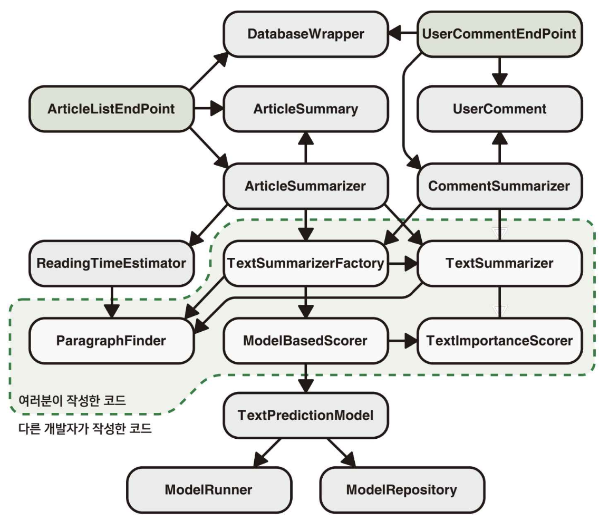
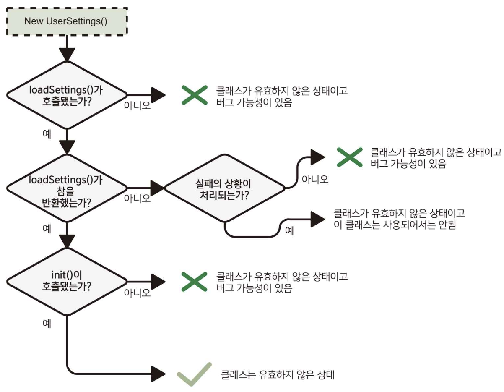
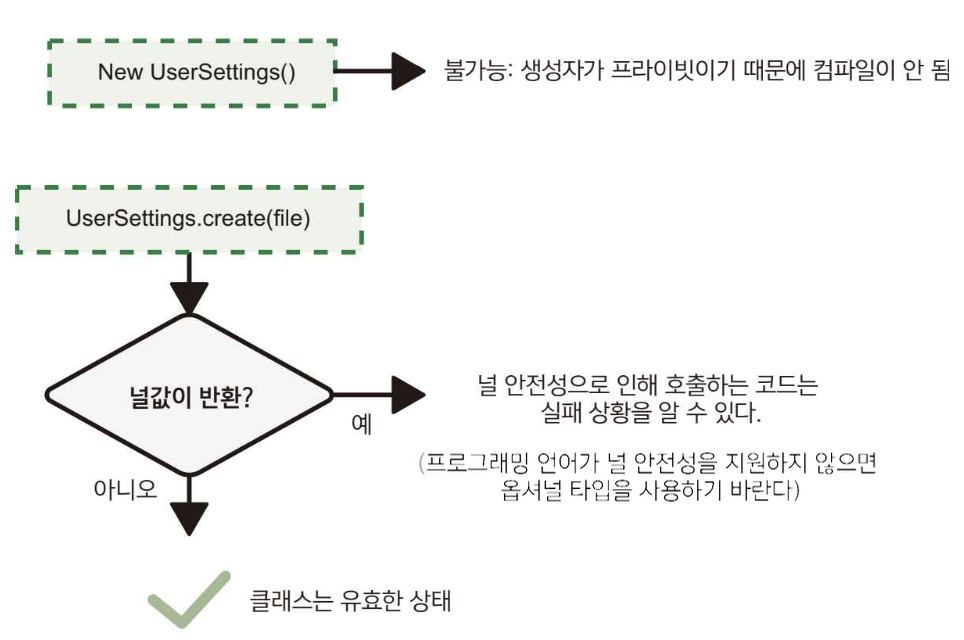

> 이 장의 내용
> 
> - 다른 개발자들이 코드와 어떻게 상호작용하는지
> - 코드 계약과 코드 계약의 세부 조항
> - 세부 조항을 최소화하는 것이 어떻게 오용과 예측을 벗어나는 코드를 예방하는데 도움이 되는지
> - 세부 조항을 피할 수 없다면 체크와 어서션을 어떻게 사용할 수 있는가?
- SW를 작성하고 유지보수하는 일은 대개 팀 단위에서 수행하는 작업

# 3.1 자신의 코드와 다른 개발자의 코드

> 여러 가지 하위 문제를 해결하고 그 하위 문제들을 간결한 추상화 계층으로 분리했다면, 다른 개발자들은 여러분이 전혀 생각지 못한 완전히 다른 문제에서 여러분이 작성한 하위 문제 해결 코드를 재사용할 수 있다.
> 

> 다른 개발자들이 활발하게 코드를 변경하더라도 코드의 품질이 유지되려면 코드가 튼튼하고 사용하기 쉬워야 한다.
> 

> 고품질 코드를 작성할 때 가장 중요한 고려 사항 중 하나는 다른 개발자가 변경하거나 코드의 상호작용할 때 발생할 수 있는 문제는 없는지, 또 발생한다면 그 문제를 어떻게 완화할 수 있을지를 이해하고 선제적으로 조치하는 것이다.
> 
- 자신이 작성한 코드가 독립적으로 존재하는 경우는 거의 없음
    - 다른 개발자들이 작성한 코드에 의존할 것이고, 다른 엔지니어 또한 우리의 코드에 의존하는 코드를 작성할 것임

## 코드를 작성할 때 고려하면 유용한 3가지

- 자신에게 명백하다고 해서 다른 사람에게도 명백한 것은 아님
- 다른 개발자는 무의식중에 우리의 코드를 망가뜨릴 수 있음
- 시간이 지남에 따라 자신의 코드를 기억하지 못함

## 3.1.1 자신에게 분명하다고 해서 다른 사람에게도 분명한 것은 아니다.

> 다른 개발자가 우리가 작성한 코드와 상호작용하거나, 우리의 코드를 변경하거나, 우리의 코드가 의존하고 있는 코드를 변경해야 할 수도 있다는 것을 기억해야 한다.
> 
- 그들은 그 문제를 이해하고 어떻게 해결할지에 대해 생각할 수 있는 시간을 아직 충분히 갖지 못한 상태임
    - 우리가 코드를 작성할 당시에 너무도 분명해 보였던 것들이 그들에게는 분명하지 않을 것
    - 따라서 우리가 코드를 어떻게 사용되어야 하는지, 무엇을 하는지, 그리고 왜 그 일을 하고 있는지 설명하는 것이 유용함
        - 주석을 작성해야한다는 의미는 아님
        - 코드를 이해하기 쉽고 코드 자체로 설명이 되게 하는 것이 좋은 방법

## 3.1.2 다른 개발자는 무의식중에 우리의 코드를 망가뜨릴 수 있다.

- 우리가 작성한 코드는 다른 코드로부터 전혀 영향을 받지 않은 채 독립적으로 있는 것이 아님
    - 끊임없이 변화하는 코드 위에 놓여있고, 우리의 코드를 기반으로 계속해서 변화하는 코드 역시 끊임없지 작성됨
- 우리의 코드는 우리 자신에게 가장 중요할지 모르지만, 다른 개발자들은 아마 그것에 대해 잘 알지 못할 것
    - 그들의 우리의 코드를 접할 때 그 코드가 왜 존재하는지 혹은 무슨 일을 수행하는지에 대한 사전 지식을 가지고 있지 않을 수 있음
    - 이 경우 다른 개발자가 의도치 않게 잘 실행되던 코드를 작동하지 않게 하거나 오용하는 방식으로 코드를 추가하거나 수정할 가능성이 큼
- 다른 개발자의 코드 변경으로 인해 우리의 코드가 작동하지 않거나 오용하는 결과를 가져온다면, 그 코드는 이 문제가 해결되지 전까지 코드베이스에 병합되면 안됨
    - 이를 위해 신뢰할 만한 방법
        - 무언가 문제가 있을 때 코드 컴파일이 중지되거나 테스트가 실패하도록 만드는 것

## 3.1.3 시간이 지나면 자신의 코드를 기억하지 못함

- 코드의 세부 사항이 지금은 마음속에서 너무나 신선하고 또한 가장 중요한 것으로 여겨지기 때문에, 그것들을 결코 잊을 수 없으리라 생각함
    - 시간이 지나면 그것을이 더 이상 신선하지 않고, 잊히기 시작함
    - 1년 후에 새로운 기능을 추가해야 하거나, 자신의 코드에서 발견된 버그를 해결해야 한다면자신이 작성한 코드임에도 불구하고 그 코드의 자세한 내용을 더 이상 기억하지 못할 수 있음
- 1~2년 전에 작성한 코드를 다시 들여다보는 일은 다른 사람이 작성한 코드를 보는 것과 크게 다르지 않음
    - 미래의 자신은 본질적으로 다른 개발자라고 간주해야 함
- 배경지식이 거의 없거나 전혀 없는 사람에게도 자신의 코드가 이해하기 쉬워야 하고, 잘 작동하는 코드에 버그가 발생하는 것이 어려워야 함
    - 이는 다른 사람에게 호의를 배푸는 것이기도 하지만, 미래의 나에게도 유익한 일

# 3.2 여러분이 작성한 코드의 사용법을 다른 사람들은 어떻게 아는가?

> 다른 개발자가 우리의 코드를 사용하거나 우리의 코드에 의존하는 코드를 수정할 때, 그들은 우리의 코드를 어떻게 사용해야 하는지 그 코드가 무슨 일을 하는지 파악해야 한다.
> 
- 이때 이해해야 하는 사항들
    - 어려 가지 상황에서 어떤 함수를 호출해야 하는지
    - 클래스가 무엇을 나타내는지 그리고 언제 사용되어야 하는지
    - 어떤 값을 인수로 사용해야 하는지
    - 코드가 수행하는 동작이 무엇인지
    - 어떤 값을 반환하는지

## 우리가 작성한 코드를 어떻게 사용해야 하는지 알아내기 위해 다른 개발자가 할 수 있는 일

- 함수, 클래스, 열거형 등의 이름을 살펴봄
- 함수와 생성자의 매개변수 유형 또는 반환값의 유형 같은 데이터 유형을 살펴봄
- 함수/클래스 수준의 문서나 주석문을 읽어봄
- 직접 와서 묻거나 채팅/이메일을 통해 문의
- 우리가 작성한 함수와 클래스의 자세한 구현 코드를 읽음

---

- 이 중 처음 3가지만이 실제로 사용할 만하고, 그중에서도 이름과 데이터 유형을 확인하는 것이 문서를 읽는 것보다 더 신뢰할 만함

## 3.2.1 이름 확인

- 이름을 살펴보는 것은 개발자들이 새로운 코드의 사용 방법을 알아내기 위해 실제로 사용하는 주된 방법 중 하나
- 패키지, 클래스, 함수의 이름을 책의 목차라고 생각할 수 있음
    - 이 이름들을 살펴보는 것은 하위 문제를 해결할 코드를 찾기 위한 편리하고 빠른 방법

## 3.2.2 데이터 유형 확인

- 제대로만 한다면 데이터 유형을 확인하는 것 역시 다른 개발자로 하여금 자신의 코드를 올바르게 사용하도록 하기 위한 매우 신뢰할 만한 방법

> 컴파일이 필요한 정적 유형의 언어에서는 데이터 유형을 인식하고 올바르게 사용해야 한다.
> 
- 그렇지 않으면 코드가 컴파일되지 않음
    - 유형 시스템을 사용하는 언어로 코드를 작성: 다른 개발자가 코드를 오용하거나 오작동할 수 없도록 하기 위한 좋은 방법 중 하나

## 3.2.3 문서 읽기

- 코드를 사용하는 방법에 관한 문서는 두 가지 이상의 형태로 존재할 수 있고 다음을 포함
    - 함수 및 클래스 수준의 비공식적인 주석문
    - 자바독과 같은 좀 더 공식적인 코드 내 문서
    - 외부 문서(`README.md`)
- 이 모든것이 매우 유용하지만 다른 개발자가 코드를 올바르게 사용하도록 하기 위한 방법으로 어느정도까지만 신뢰할 수 있음
    - 다른 개발자가 이 문서들을 읽을 것이라는 보장이 없음
        - 실제로 읽지 않을 때가 많음
    - 설령 읽더라도 잘못 해석할 수 있음
        - 다른 개발자들이 익숙하지 않은 용어를 사용할 수도 있고, 코드가 해결하려는 문제에 관해 다른 개발자들이 가지고 있을 지식의 수준이나 정도에 대해 잘못된 가정을 바탕으로 문서를 작성할 수도 있음
    - 문서의 업데이트가 제대로 안 될 수 있음
        - 개발자의 코드를 변경할 때마다 문서를 업데이트해야 함
            - 이것을 잊어버리면 코드에 대한 문서의 내용이 더 이상 유효하지 않게 됨

## 3.2.4 직접 물어보기

- 코드의 사용법을 설명하는 것이 신뢰하기 어려운 이유
    - 코드를 많이 작성할수록 질문에 답하는 데 많은 시간을 써야 할 것
        - 결국에는 이 모든 질문에 답하기 위해 하루 종 몇 시간을 써야 할 수도 있음
    - 코드 작성자가 2주간 휴가를 간다면 코드에 대해 물어볼 사람이 없음
    - 1년이 지나면 자기 자신도 그 코드를 기억하지 못한다.
        - 그래서 실제로 이런 접근법을 어느정도 제한된 기간 동안만 효과가 있음
    - 코드를 작성한 사람이 회사를 떠날 수도 있는데, 이 경우에는 코드를 사용하는 방법에 대한 지식이 사저려 버림

## 3.2.5 코드를 살펴보는 것

- 코드 사용 방법에 대한 가장 확실한 답을 얻을 수 있는 방법: 코드의 자세한 구현 세부 사항을 살펴보는 것
    - 이 접근법은 실용적이지도 않고 코드의 양이 많으면 효과를 얻기 힘듦
- 다른 개발자가 우리의 코드를 사용하기로 한다면, 그것은 아마도 그들이 의존하고 있는 수많은 코드들 중 하나일 것
    - 그들이 의존하는 코드의 구현 세부 사항을 살펴봐야 한다면, 어떤 기능을 구현할 때마다 수천 줄의 코드를 읽어야 할 것임
- 만일 코드베이스에 작업하는 모든 개발자가 ‘내 코드의 사용 방법을 이해하고 싶으면 코드 안에서 어떻게 구현됐는지 읽어보면 되지 뭐’라는 자세를 갖는다면 상황은 더 악화될 수 있음
    - 한 의존 코드는 또다시 다른 코드에 의존하기 때문에 이런 상황에서는 일부 또는 모든 하위 의존 코드의 구현 세부사항을 읽어야 할 것이고, 이런 하위 의존 라이브러리의 수가 족히 수백 개는 될 것임
    - 모든 개발자들은 적당한 크기의 기능을 구현하려고 해도 수십만 줄의 코드를 읽어야 할 수도 있음
- 추상화 계층을 만드는 데 있어 요점
    - 개발자가 한 번에 몇 가지 개념만 처리해야 함
    - 그 문제가 어떻게 해결되었는지 정확히 알지 못하더라고 하위 문제에 대한 해결책을 사용할 수 있어야 함
- 코드를 사용하는 방법을 알기 위해 개발자가 구현 세부 사항을 읽어야 한다면 이는 분명히 추상화 계층의 많은 이점을 부정하는 것

# 3.3 코드 계약

- 계약에 의한 프로그래밍 또는 계약에 의한 디자인: 다른 사람들이 어떻게 코드를 사용할지, 그리고 코드가 무엇을 할 것으로 기대할 수 있는지에 대한 것
    - 서로 다른 코드 간의 상호작용을 마치 계약처럼 생각 함

## 코드의 계약에 대한 용어의 3가지 범주

- 선결 조건(precondition): 코드를 호출하기 전에 사실이어야 하는 것
- 사후 조건(postcondition): 코드가 호출된 후에 사실이어야 하는 것
- 불변 사항(invariant): 코드가 호출되기 전과 후에 시스템 상태를 비교해서 변경되지 않아야 하는 사항

---

- 우리가 작성하는 코드는 어떤 종류의 계약을 맺는 것이라고 봐도 무방함
    - 입력 매개변수가 있는 함수를 작성하거나, 값을 반환하거나, 어떤 상태를 수정하면 이것은 계약을 제공해야 할 요건을 부여하고, 호출 결과 일어날 일 혹은 반환될 값에 대한 기대를 갖게 하기 때문
- 개발자가 계약의 일부 혹은 모든 조건을 알지 못하면 코드 계약 문제가 발생함

> 코드를 작성할 때, 만들어지는 계약의 내용이 무엇일지 그리고 어떻게 하면 코드를 사용하는 사람이 계약을 파악하고 따라갈 수 있을지에 대해 생각하는 것이 중요하다.
> 

## 3.3.1 계약의 세부 조항

### 계약의 명확한 부분

- 함수의 클래스 이름: 호출하는 쪽에서 이것을 모르면 코드를 사용할 수 없음
- 인자 유형: 호출하는 쪽에서 인자의 유형을 잘못 사용하면 코드를 컴파일조차 되지 않음
- 반환 유형: 호출하는 쪽에서 함수의 반환 유형을 알아야 함
    - 이 유형과 일치하지 않는 유형을 사용하면 코드는 컴파일되지 않음
- 검사 예외: 호출하는 코드가 이것을 처리하지 않으면 코드는 컴파일되지 않음

### 세부 조항

- 주석문과 문서: 실제 계약의 세부 조항에 대해 그렇듯이 꼼꼼하게 모두 다 읽어봐야 하는 것임에도 실제로는 잘 읽지 않음
    - 개발자는 이 사실을 실용적인 관점에서 봐야 함
- 비검사 예외: 주석문에 이 예외가 나열되어 있다면 이것은 세부 조항
    - 어떤 때는 심지어 세부 조항에서도 나와 있지 않을 수도 있음

---

- 코드 계약에서 조건을 명백하게 하는 것이 세부 조항을 사용하는 것보다 훨씬 나음
    - 사람들은 세부조항을 읽지 않는 경우가 매우 많으며, 심지어 읽더라도 그것을 대충 훑어보기 때문에, 잘못 이해할 수 있음
    - 문서화는 업데이트가 제때 되지 않기 대문에 세부 조항이 항상 정확한 것도 아님

## 3.3.2 세부조항에 너무 의존하지 말라

- 주석문과 문서의 형태도 된 세부 조항은 간과하고 넘어갈 때가 많기 때문에 다른 개발자들이 해당 코드를 사용할 때 모든 세부 조항을 다 알지 못할 가능성이 큼
    - 코드 계약을 전달할 대 세부 조항을 사용하는 것은 신뢰할 만한 방법이 아님
        - 세부 조항에 너무 많이 의존하면 오용하기 쉬운 취약한 코드가 될 가능성이 크고, 예상과 다르게 동작하기 쉬움
        - 이는 고품질 코드의 적

### 세부 조항에 의존하는 것을 피할 수 없는 경우

- 어떤 문제들은 항상 주의 사항이 있고 이것을 설명해야 할 때
- 어쩔 수 없이 다른 사람이 작성한 저품질의 코드에 의존해야 할 때
- 위의 상황일 경우, 자신의 코드는 약간 이상하게 동작할 수밖에 없음
    - 이런 상황을 설명하는 문서화된 세부 조황이 필요하고, 다른 개발자들이 이 문서를 읽도록 해야 함
        - 문서는 읽지 않을 가능성이 크거나 업데이트가 안될 가능성이 크기 때문에, 문서화는 이상적인 방법이 아님

---

- 명확하지 않을 수도 있는 사항들을 문서화하는 것은 일반적으로 좋은 생각
    - 너무 많이 의존하지 않는 것이 최선의 방법
    - 코드 계약의 분명한 항목을 통해 코드에 관해 명확하게 설명하는 것이 가능하다면 그렇게 하는 것이 더 바람직함
- 코드를 오용할 수 있는 방법이 많을수록 실제로 오용되고 SW에 버그가 있을 가능성이 큼

### 세부 조항을 제거하는 방법

- 다른 개발자가 코드를 올바르게 사용하기 위해 세부 조항에 의존하기보다 잘못된 일을 하는 것을 처음부터 불가능하게 만드는 것이 좋음
- 코드 걔역의 세부 조항에 있는 어던 항목에 대해 발생 자체가 불가능하도록 명백한 항목으로 바꾸는 것이 가능한 경우가 있음
    - 코드가 어떤 상태에 들어갈 수 있는지 혹은 입력이나 반환으로 어던 데이터의 유형을 취할 수 있는지 신중하게 생각해보면 이렇게 변경하는 것이 가능할 때가 있음
- 코드를 오용하는 것이 불가능하면 다른 개발자들이 그 코드를 사용할 때 버그가 침투할 가능성이 훨씬 낮아짐

# 3.4 체크 및 어서션

- 런타임 검사: 컴파일러를 사용하여 코드 계약을 확인하는 것에 대안
    - 일반적으로 컴파일 타임 확인만큼 강력하지는 않은데, 왜냐하면 코드 계약이 준수되었는지 확인하기 위한 추가적인 로직
        - 준수되지 않을 경우 체크는 실패를 유발하는 오류를 생성
            - 이 실패는 명백해서 놓치고 넘어가는 것이 불가능

## 3.4.1 체크

### 체크가 구분되는 2가지 범주

- 전제 조건 검사: 입력 인수가 올바르거나, 초기화가 수행되었거나, 일부 코드를 실행하기 전에 시스템이 유효한 상태인지 확인하는 경우
- 사후 상태 검사: 반환값이 올바르거나 일부 코드를 실행한 후 시스템이 유효한 상태인지 확인하는 경우

---

- 체크를 사용할 때 기대하는 것: 코드가 오용되면 고객에게 배포되거나 실제 프로덕션에서 서비스되기 전에 개발 단계나 테스트 단계에서 발견되고 수정되는 것

### 체크의 효과가 보장되는 것이 아닌 이유

- 테스트하기가 불분명한 상황에서만 확인 중인 조건이 위반된다면, 코드가 배포되고 사용자가사용하기 전까지 버그나 노출되지 않을 수 있음
- 체크가 잘 작동해서 실패가 명백함에도 불구하고 아무도 알아차리지 못할 위험이 있음
    - 예외가 일어나더라도 시스템이 작동을 완전히 멈추기 않도록 하기 위해 프로그램의 상위 수준에서 예외가 처리되고 오류의 자세한 사항이 로그에 기록될 수 있음
    - 개발자가 이 로그들을 신경 쓰지 않는다면, 오류가 발생할 때 아무도 알아차리지 못함
    - 이런 일이 일어나면 개발과 관련해 팀의 실행지침에 심각한 문제가 있음을 시사함
        - 이런 문제는 필요 이상으로 자주 발생함
- 경우에 따라 코드 계약에서 세부 조항을 피할 수 없으며, 이때는 계약이 준수되는지 확인하기 위해 체크를 추가하는 것이 좋음
    - 가능하다면 처음부터 세부 조항은 피하는 것이 바람직함
    - 코드에 체크가 많이 있으면 세부 조항을 없애는 것에 대해 고려해봐야 한다는 신호일지도 모름

## 3.4.2 어서션

- 어서션: 코드 계약을 준수하도록 강제하기 위한 방법이라는 점에서 체크와 매우 유사함
    - 많은 언어에서, 언어차원에서 지원함
- 코드가 개발 모드에서 컴파일 되거나 테스트가 실행도리 때, 어서션은 체크와 거의 같은 방식으로 동작함
    - 조건이 위반되면 오류가 명백하게 보이거나, 예외가 발생
- 어서션과 체크 사이의 주요 차이점: 배포를 위해 빌드할 때 어서션은 보통 컴파일에서 제외됨
    - 코드가 실제 서비스 환경에서 사용될 때 실패를 명백하게 보여주지 않는다는 것을 의미

### 코드를 배포할 때 컴파일하지 않는 이유

- 성능 향상을 위해
    - 조건이 위반되는지 확인하려면 CPU 사이클이 필요함
    - 코드에서 어서션이 많으면 SW의 전반적인 성능이 눈에 띄게 저하될 수 있음
- 코드 오류 발생률을 낮추기 위해
    - 이것이 유효한 동기인지 아닌지는 특정 응용 프로그램에 달려있음
        - 이로 인해 버그가 눈에 띄지 않을 가능성이 증가하지만 버그 발생 가능성 방지보다 고가용성이 더 중요한 시스템이라면 배포 시 컴파일에서 제외하는 것은 적절한 절충이 될 수 있음

---

- 코드의 배포를 위한 빌드에서도 어서션을 사용할 수 있는 방법이 있음
    - 많은 개발팀이 이렇게 함
    - 어서션은 체크와 다르지 않고, 다만 어떤 종류의 오류나 예외를 발생시킬 수 있는지에 대한 일부 세부 사항이 조금 다를 뿐임

# 요약

- 코드베이스는 계속 변하고 일반적으로 여러 개발자에 의해 변경됨
- 다른 개발자가 어떻게 코드를 해석하고 오용할 수 있을지 생각해보고, 이러한 가능성을 최소화하거나 오용이 불가능하게 만드는 방식으로 코드를 작성하는 것이 유용함
- 코드를 작성할 때 일종의 코드 계약이 항상 만들어짐
    - 여기에는 명백한 항목이나 세부 조항과 같은 내용이 포함될 수 있음
- 코드 계약의 세부 조항은 다른 개발자가 계약을 준수하도록 하기 위한 방법
    - 신뢰할만한 방법은 아님
    - 보통 더 나은 접근법은 명백한 항목으로 계약의 내용을 전달하는 것
- 일반적으로 컴파일러를 사용하여 계약을 확인하는 것이 가장 신뢰할 수 있는 방법
    - 이것이 가능하지 않을 때, 체크나 어서션을 사용하여 실행 시간에 계약을 확인할 수 있음